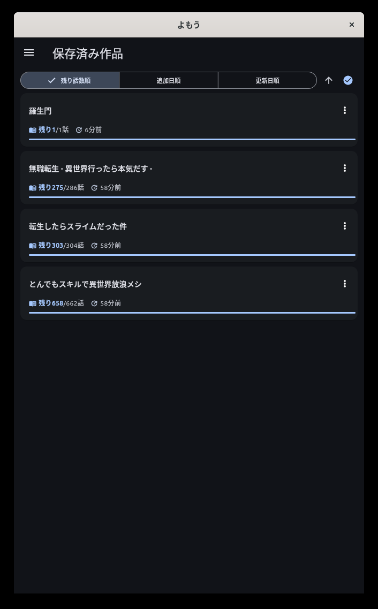
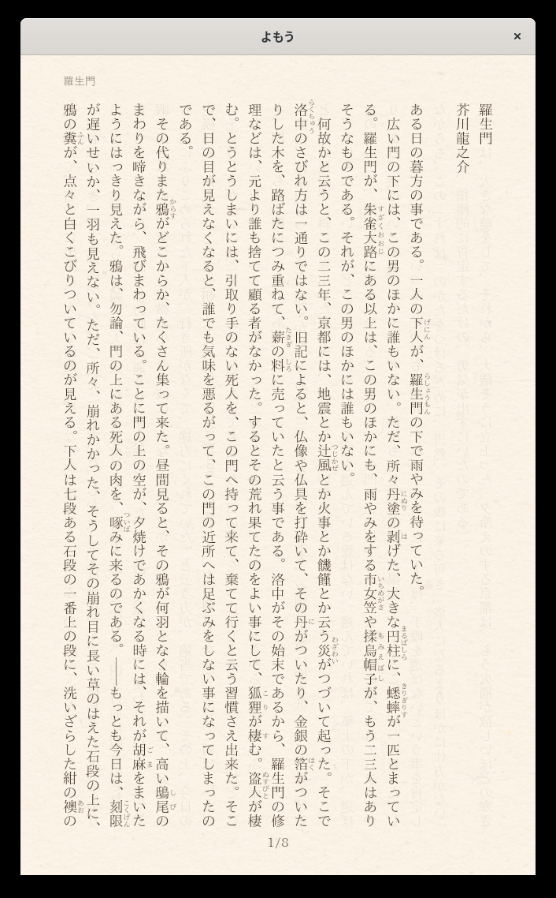

# よもう

日本のWeb小説・文学作品をまとめて読める小説リーダーアプリです。

  
  

## 対応サイト

- **小説家になろう** — 人気Web小説の検索・ランキング閲覧・作品の保存と読書ができます
- **小説家になろう（R18）** — ノクターンノベルズ等のR18作品に対応
- **カクヨム** — KADOKAWAのWeb小説プラットフォームの作品を検索・閲覧できます
- **ノベルアップ+** — HJ文庫のWeb小説投稿サイトの作品を検索・閲覧できます
- **ハーメルン** — 二次創作・オリジナル小説の検索・ランキング閲覧ができます
- **青空文庫** — 著作権の切れた日本文学の名作を読むことができます

## 主な機能

### 作品の検索・発見

- キーワード・ジャンル・作者名などで小説を検索
- 各サイトのランキング（日間・週間・月間など）を閲覧
- 新着作品のチェック

### 快適な読書体験

- **縦書き・横書き**の切り替えに対応
- **フォントサイズ**や**余白**の調整
- **和紙風テクスチャ**など紙面の色合いを選択可能（白・和紙・ダーク）
- 横向き時の**見開き表示**
- タップで直感的にページ送り

### ライブラリ管理

- 気に入った作品を保存してマイライブラリを構築
- **読書の続き**をワンタップで再開（ページ位置を自動記憶）
- 残り話数順・追加日順・更新日順などで並べ替え
- 新しいエピソードの更新チェック

### カスタマイズ

- ダーク・ライトテーマの切り替え
- リーダーの各種設定（文字サイズ、組方向、タップ領域、紙面の色など）
